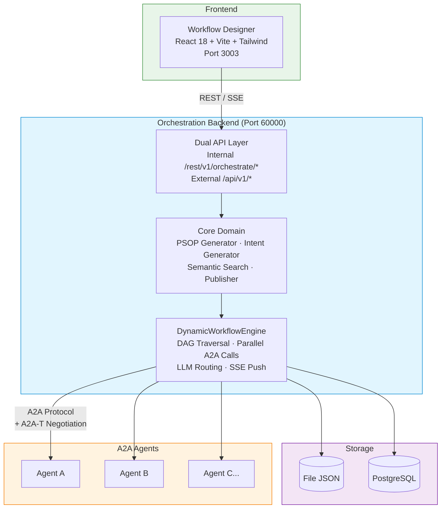

<!--
Copyright (c) 2026 Huawei Technologies Co., Ltd.
All Rights Reserved.

   Licensed under the Apache License, Version 2.0 (the "License"); you may
   not use this file except in compliance with the License. You may obtain
   a copy of the License at

        http://www.apache.org/licenses/LICENSE-2.0

   Unless required by applicable law or agreed to in writing, software
   distributed under the License is distributed on an "AS IS" BASIS, WITHOUT
   WARRANTIES OR CONDITIONS OF ANY KIND, either express or implied. See the
   License for the specific language governing permissions and limitations
   under the License.
-->

# A2A-T Multi-Agent Orchestration Center

<p align="center">
  <a href="https://www.python.org/"></a>
  <a href="https://nodejs.org/"></a>
  <a href="LICENSE"></a>
</p>

<p align="center">
  <strong>A visual orchestration platform for multi-agent collaboration via the A2A-T protocol.</strong>
  <br>
  基于 A2A-T 协议的多智能体可视化编排平台。
</p>

<p align="center">
  <a href="./README_zh.md">中文</a>
</p>

---

## Overview

The Orchestration Center is a visual platform for designing and executing multi-agent workflows. It provides a **drag-and-drop workflow designer**, an **async execution engine**, and **A2A-T negotiation** integration — enabling teams to build, manage, and run complex agent collaboration flows without writing code.

**Use cases:** Telecom network assurance workflows, RAN energy-saving orchestration, SPN fault handling pipelines, enterprise multi-agent automation.

```mermaid
graph TB
    subgraph CONSUMERS["&#xa0;"]
        direction LR
        UI["Workflow Designer<br/>React 18 · React Flow<br/>:3003"]
        EXT["External API Clients<br/>REST / SSE"]
    end

    subgraph BACKEND["FastAPI Backend :60000"]
        direction TB
        API["API Layer<br/><i>/rest/v1/orchestrate/* (internal)  ·  /api/v1/* (external)</i>"]
        
        subgraph DOMAIN["Core Domain"]
            direction LR
            GEN["PSOP Generator<br/>PDF/SOP → PSOP"]
            INT["Intent Orchestration<br/>NL → PSOP"]
            SEARCH["Semantic Retrieval<br/>LLM search"]
        end
        
        ENG["DynamicWorkflowEngine<br/>DAG traversal · parallel A2A calls · A2A-T negotiation · SSE push"]
        
        subgraph STORE["Pluggable Storage"]
            direction LR
            FS["File JSON"]
            PG["PostgreSQL"]
        end
    end

    subgraph EXTSERV["&#xa0;"]
        direction LR
        LLM["LLM<br/>OpenAI-compatible"]
        REG["Agent Registry<br/>AgentCard discovery"]
        subgraph AGENTS["A2A Agents"]
            direction LR
            A1["dispatch"]
            A2["ran"]
            A3["energy_saving"]
            A4["spn_city"]
            A5["assurance"]
            A6["live_streaming"]
            A7["uncertainty"]
            A8["negotiation_base"]
        end
    end

    UI -->|REST| API
    EXT -->|REST / SSE| API
    API --> GEN & INT & SEARCH & ENG
    GEN & INT & SEARCH -.->|LLM calls| LLM
    GEN & INT & ENG <-->|AgentCards| REG
    GEN & INT & SEARCH & ENG --> STORE
    ENG <==>|A2A gRPC/HTTP| AGENTS
    ENG -.->|SSE| UI
    ENG -.->|SSE| EXT
```



## Features

| Category | Capability |
|----------|------------|
| **Visual Designer** | React Flow-based drag-and-drop workflow builder with automatic Dagre layout |
| **Multi-Mode Creation** | PDF document import, manual drag-and-drop, and natural-language-to-workflow via LLM |
| **A2A-T Negotiation** | Fulfillment negotiation between agents via a2a-t-sdk, context carried in Task.metadata |
| **Execution Engine** | `DynamicWorkflowEngine` — async DAG traversal, parallel A2A calls, conditional LLM routing, SSE streaming |
| **Semantic Search** | Natural-language retrieval of previously built workflows |
| **Dual API Layer** | Internal API (`/rest/v1/orchestrate/*`) for the frontend + External API (`/api/v1/*`) for third-party integration |
| **SSE Streaming** | Real-time execution progress via 8 event types (init, start, agent_request, agent_response, complete, error, etc.) |
| **Pluggable Storage** | File-based JSON (default) or PostgreSQL persistence via HandlerRegistry |
| **Template Marketplace** | Pre-built workflow templates for telecom scenarios (live broadcast, energy saving, fault handling) |
| **Sample Agents** | 8+ sample A2A agents with negotiation support for testing and demonstration |

## Quick Start

### Prerequisites

| Component | Requirement |
|-----------|-------------|
| Python | 3.12+ |
| Node.js | 20.19+ |

### Install & Run

```bash
# Clone the repository
git clone https://gitcode.com/OpenAN/orchestration-center.git
cd orchestration-center

# Backend setup
python3 -m venv .venv
source .venv/bin/activate      # Linux
# .venv\Scripts\activate       # Windows
pip install -r requirements.txt

# Start backend (port 60000)
python -m orchestrate.start

# Frontend setup (separate terminal)
cd workflow-designer
npm install --force
npm run dev                     # port 3003

# (Optional) Start sample agents
cd ..
python -m samples.start_agents_server
```

### Verify

| Service | Check |
|---------|-------|
| Backend | `Uvicorn running on http://127.0.0.1:60000` |
| Frontend | Open `http://localhost:3003` in browser |
| Sample Agents | Agent startup messages in console |

## Architecture



## API Overview

### External API (`/api/v1/*`)

| Method | Endpoint | Description |
|--------|----------|-------------|
| `POST` | `/api/v1/orchestrate/sop` | SOP-based workflow orchestration (JSON text or file upload) |
| `POST` | `/api/v1/orchestrate/intent` | Intent-based workflow orchestration |
| `GET` | `/api/v1/orchestrate/psop/{id}` | Get PSOP workflow detail |
| `POST` | `/api/v1/orchestrate/search` | Search workflows by natural language intent |
| `POST` | `/api/v1/orchestrate/execute` | Auto-orchestrate + execute (SSE streaming) |
| `GET` | `/api/v1/orchestrate/execute/{id}` | Execute a known PSOP (SSE streaming) |
| `GET` | `/api/v1/executions` | List execution records |
| `GET` | `/api/v1/executions/{id}` | Get execution result |

### Internal API (`/rest/v1/orchestrate/*`)

| Method | Endpoint | Description |
|--------|----------|-------------|
| `GET` | `/workflows` | List workflows |
| `GET` | `/workflows/{id}` | Get workflow detail |
| `POST` | `/workflows` | Create workflow |
| `DELETE` | `/workflows/{id}` | Delete workflow |
| `POST` | `/generate-from-preflow` | Generate PSOP from PreFlow |
| `POST` | `/generate-from-intent` | Generate PSOP from intent |
| `POST` | `/retrieve-by-intent` | Retrieve workflow by intent |
| `POST` | `/retrieve-topn-by-intent` | Retrieve top-N workflows by intent |
| `GET` | `/agent-cards` | List available agent cards |
| `GET` | `/templates` | List workflow templates |
| `POST` | `/templates/{id}/import` | Import workflow from template |
| `GET` | `/execute` | Start workflow execution (SSE) |
| `GET` | `/execution-records` | List execution records |
| `GET` | `/execution-records/{id}` | Get execution record detail |
| `DELETE` | `/execution-records/{id}` | Delete execution record |

Full API specification: [API Reference](docs/en/Orchestration%20Center%20API%20Reference.md)

## Configuration

| Config File | Purpose |
|-------------|---------|
| `etc/conf/server.conf` | Server IP, port, TLS certificates, persistence mode, registry URL |
| `etc/conf/server.properties` | TLS versions, ciphers, rate limiting, connection limits |
| `etc/conf/db_config.json` | PostgreSQL connection settings |
| `common/config/llm_config.json` | LLM/embed/rerank model endpoints |
| `common/config/README_en.md` | LLM configuration guide |

## A2A-T SDK Integration

This project integrates a2a-t-sdk for agent fulfillment negotiation:

```bash
A2AT_LLM_PROVIDER=deepseek
A2AT_LLM_MODEL=deepseek-chat
A2AT_LLM_API_KEY=<your-api-key>
A2AT_LLM_BASE_URL=https://api.deepseek.com
A2AT_NEGOTIATION_STATE_STORE_TYPE=in_memory
```

Configuration is auto-generated by `common/a2at_config.py` from `common/config/llm_config.json`.

## Documentation

### English

| Document | Language | Description |
|----------|----------|-------------|
| [User Guide](docs/en/Orchestration%20Center%20User%20Guide.md) | EN | Features, scenarios, quick start, FAQ |
| [API Reference](docs/en/Orchestration%20Center%20API%20Reference.md) | EN | Full REST API specification |
| [Developer Guide](docs/en/Orchestration%20Center%20Development%20Guide.md) | EN | Custom handlers, LLM module, extension |
| [Frontend README](workflow-designer/README.md) | EN | Workflow Designer setup and tech stack |
| [LLM Config](common/config/README_en.md) | EN | LLM configuration reference |

### 中文

| Document | Language | Description |
|----------|----------|-------------|
| [用户指南](docs/zh/用户指南.md) | 中文 | 特性介绍、使用场景、快速入门、FAQ |
| [API 参考](docs/zh/编排中心API参考.md) | 中文 | 完整 REST API 规范 |
| [开发指南](docs/zh/开发指南.md) | 中文 | 自定义处理器、LLM 模块、扩展开发 |
| [设计文档](docs/DESIGN.md) | 中文 | 系统架构与设计 |

## License

This project is licensed under the **Apache License 2.0**. See [LICENSE](LICENSE) for details.
