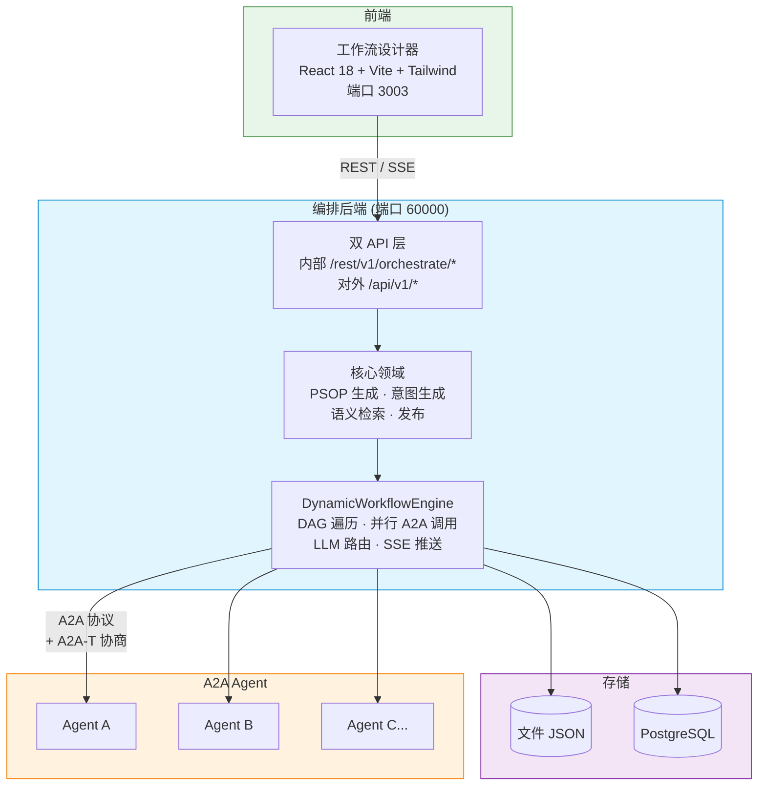

<!--
Copyright (c) 2026 Huawei Technologies Co., Ltd.
All Rights Reserved.

   Licensed under the Apache License, Version 2.0 (the "License"); you may
   not use this file except in compliance with the License. You may obtain
   a copy of the License at

        http://www.apache.org/licenses/LICENSE-2.0

   Unless required by applicable law or agreed to in writing, software
   distributed under the License is distributed on an "AS IS" BASIS, WITHOUT
   WARRANTIES OR CONDITIONS OF ANY KIND, either express or implied. See the
   License for the specific language governing permissions and limitations
   under the License.
-->

# A2A-T 多智能体编排中心

<p align="center">
  <a href="https://www.python.org/"></a>
  <a href="https://nodejs.org/"></a>
  <a href="LICENSE"></a>
</p>

<p align="center">
  <strong>基于 A2A-T 协议的多智能体可视化编排平台。</strong>
  <br>
  A visual orchestration platform for multi-agent collaboration via the A2A-T protocol.
</p>

<p align="center">
  <a href="./README.md">English</a>
</p>

---

## 概述

编排中心是一个面向多智能体（Agent）协作的可视化编排平台，提供拖拽式工作流设计器、异步执行引擎和 A2A-T 协商集成。

**典型场景：** 电信网络保障工作流、RAN 节能编排、SPN 故障处理流水线、企业多智能体自动化。

```mermaid
graph TB
    subgraph CONSUMERS["&#xa0;"]
        direction LR
        UI["Workflow Designer<br/>React 18 · React Flow<br/>:3003"]
        EXT["External API Clients<br/>REST / SSE"]
    end

    subgraph BACKEND["FastAPI Backend :60000"]
        direction TB
        API["API Layer<br/><i>/rest/v1/orchestrate/* (internal)  ·  /api/v1/* (external)</i>"]
        
        subgraph DOMAIN["Core Domain"]
            direction LR
            GEN["PSOP Generator<br/>PDF/SOP → PSOP"]
            INT["Intent Orchestration<br/>NL → PSOP"]
            SEARCH["Semantic Retrieval<br/>LLM search"]
        end
        
        ENG["DynamicWorkflowEngine<br/>DAG traversal · parallel A2A calls · A2A-T negotiation · SSE push"]
        
        subgraph STORE["Pluggable Storage"]
            direction LR
            FS["File JSON"]
            PG["PostgreSQL"]
        end
    end

    subgraph EXTSERV["&#xa0;"]
        direction LR
        LLM["LLM<br/>OpenAI-compatible"]
        REG["Agent Registry<br/>AgentCard discovery"]
        subgraph AGENTS["A2A Agents"]
            direction LR
            A1["dispatch"]
            A2["ran"]
            A3["energy_saving"]
            A4["spn_city"]
            A5["assurance"]
            A6["live_streaming"]
            A7["uncertainty"]
            A8["negotiation_base"]
        end
    end

    UI -->|REST| API
    EXT -->|REST / SSE| API
    API --> GEN & INT & SEARCH & ENG
    GEN & INT & SEARCH -.->|LLM calls| LLM
    GEN & INT & ENG <-->|AgentCards| REG
    GEN & INT & SEARCH & ENG --> STORE
    ENG <==>|A2A gRPC/HTTP| AGENTS
    ENG -.->|SSE| UI
    ENG -.->|SSE| EXT
```



## 核心能力

| 能力 | 说明 |
|------|------|
| **可视化编排** | 基于 React Flow 的拖拽式工作流设计器，支持自动 Dagre 布局 |
| **多模式生成** | 支持 PDF 文档导入、手动拖拽编排、自然语言生成三种工作流创建方式 |
| **A2A-T 协商集成** | 集成 a2a-t-sdk 的 fulfillment 协商能力，协商上下文通过 Task.metadata 携带 |
| **执行引擎** | `DynamicWorkflowEngine` — 异步 DAG 遍历、并行 A2A 调用、LLM 条件路由、SSE 流式推送 |
| **语义检索** | 基于自然语言意图检索历史工作流，快速复用已有流程 |
| **双 API 层** | 内部 API（`/rest/v1/orchestrate/*`）供前端调用 + 对外 API（`/api/v1/*`）供第三方集成 |
| **SSE 流式推送** | 8 种事件类型（init、start、agent_request、agent_response、complete、error 等）实时推送执行进度 |
| **可插拔存储** | 文件 JSON（默认）或 PostgreSQL 持久化，通过 HandlerRegistry 切换 |
| **模板市场** | 预置电信场景工作流模板（直播保障、节能、故障处理） |
| **示例 Agent** | 8+ 示例 A2A Agent，集成协商能力，用于测试和演示 |

## 快速开始

### 环境要求

| 组件 | 版本要求 |
|------|----------|
| Python | 3.12+ |
| Node.js | 20.19+ |

### 安装运行

```bash
# 克隆仓库
git clone https://gitcode.com/OpenAN/orchestration-center.git
cd orchestration-center

# 后端启动
python3 -m venv .venv
source .venv/bin/activate      # Linux
# .venv\Scripts\activate       # Windows
pip install -r requirements.txt
python -m orchestrate.start    # 端口 60000

# 前端启动（新终端）
cd workflow-designer
npm install --force
npm run dev                     # 端口 3003

# （可选）启动示例 Agent
cd ..
python -m samples.start_agents_server
```

### 验证

| 服务 | 验证方式 |
|------|----------|
| 后端 | 日志输出 `Uvicorn running on http://127.0.0.1:60000` |
| 前端 | 浏览器访问 `http://localhost:3003` |
| 示例 Agent | 控制台输出各 Agent 启动信息 |

## 架构



## API 概览

| 方法 | 端点 | 说明 |
|------|------|------|
| `POST` | `/api/v1/solution-package/import` | 导入解决方案包（PDF） |
| `POST` | `/api/v1/psops/auto-orchestrate` | 通过描述自动生成工作流 |
| `POST` | `/api/v1/psops` | 创建 PSOP 工作流 |
| `GET` | `/api/v1/psops` | 查询工作流列表 |
| `GET` | `/api/v1/psops/{psop_id}` | 获取工作流详情 |
| `PUT` | `/api/v1/psops/{psop_id}` | 更新工作流 |
| `DELETE` | `/api/v1/psops/{psop_id}` | 删除工作流 |
| `POST` | `/api/v1/psops/{psop_id}/execute` | 执行工作流（SSE 流式推送） |
| `GET` | `/api/v1/psops/{psop_id}/executions` | 查询执行记录 |
| `POST` | `/api/v1/retrieve` | 语义检索工作流 |
| `POST` | `/api/v1/psops/publish` | 发布工作流版本 |

完整规范：[API 参考](docs/zh/编排中心API参考.md)

## 配置速查

| 配置文件 | 用途 |
|----------|------|
| `etc/conf/server.conf` | 服务 IP、端口、TLS 证书、持久化模式、注册中心 URL |
| `etc/conf/server.properties` | TLS 版本、密码套件、流控参数、连接限制 |
| `etc/conf/db_config.json` | PostgreSQL 连接配置 |
| `common/config/llm_config.json` | LLM/Embedding/Rerank 模型端点 |
| `common/config/README_zh.md` | LLM 配置指南 |

## A2A-T SDK 集成

本项目集成了 a2a-t-sdk 的 fulfillment 协商能力：

```env
A2AT_LLM_PROVIDER=deepseek
A2AT_LLM_MODEL=deepseek-chat
A2AT_LLM_API_KEY=<your-api-key>
A2AT_LLM_BASE_URL=https://api.deepseek.com
A2AT_NEGOTIATION_STATE_STORE_TYPE=in_memory
```

配置由 `common/a2at_config.py` 从 `common/config/llm_config.json` 自动生成。

## 文档导航

| 文档 | 说明 |
|------|------|
| [用户指南](docs/zh/用户指南.md) | 特性介绍、使用场景、快速入门、FAQ |
| [API 参考](docs/zh/编排中心API参考.md) | 完整 REST API 规范 |
| [开发指南](docs/zh/开发指南.md) | 自定义处理器、LLM 模块、扩展开发 |
| [设计文档](docs/DESIGN.md) | 系统架构与设计 |
| [前端 README](workflow-designer/README.md) | 工作流设计器技术栈与开发 |
| [LLM 配置](common/config/README_zh.md) | LLM 配置文件说明 |

> 英文文档请参见 [docs/en/](docs/en/)。

## 许可证

本项目基于 **Apache License 2.0** 开源协议。详见 [LICENSE](LICENSE)。
