# OpenAN 编排中心 设计文档

*版本: 1.0*

## 1. 系统架构总览

```mermaid
graph TB
    subgraph CONSUMERS["&#xa0;"]
        direction LR
        UI["Workflow Designer<br/>React 18 · React Flow<br/>:3003"]
        EXT["External API Clients<br/>REST / SSE"]
    end

    subgraph BACKEND["FastAPI Backend :60000"]
        direction TB
        API["API Layer<br/><i>/rest/v1/orchestrate/* (internal)  ·  /api/v1/* (external)</i>"]
        
        subgraph DOMAIN["Core Domain"]
            direction LR
            GEN["PSOP Generator<br/>PDF/SOP → PSOP"]
            INT["Intent Orchestration<br/>NL → PSOP"]
            SEARCH["Semantic Retrieval<br/>LLM search"]
        end
        
        ENG["DynamicWorkflowEngine<br/>DAG traversal · parallel A2A calls · A2A-T negotiation · SSE push"]
        
        subgraph STORE["Pluggable Storage"]
            direction LR
            FS["File JSON"]
            PG["PostgreSQL"]
        end
    end

    subgraph EXTSERV["&#xa0;"]
        direction LR
        LLM["LLM<br/>OpenAI-compatible"]
        REG["Agent Registry<br/>AgentCard discovery"]
        subgraph AGENTS["A2A Agents"]
            direction LR
            A1["dispatch"]
            A2["ran"]
            A3["energy_saving"]
            A4["spn_city"]
            A5["assurance"]
            A6["live_streaming"]
            A7["uncertainty"]
            A8["negotiation_base"]
        end
    end

    UI -->|REST| API
    EXT -->|REST / SSE| API
    API --> GEN & INT & SEARCH & ENG
    GEN & INT & SEARCH -.->|LLM calls| LLM
    GEN & INT & ENG <-->|AgentCards| REG
    GEN & INT & SEARCH & ENG --> STORE
    ENG <==>|A2A gRPC/HTTP| AGENTS
    ENG -.->|SSE| UI
    ENG -.->|SSE| EXT
```



**数据流方向**: 用户意图/PreFlow → PSOP生成 → 存储 → 执行引擎 → A2A Agent并行调用 → SSE事件推送 → 执行记录存储

---

## 2. 领域模型设计

### 2.1 核心模型关系

```text
PreFlow (人工SOP模板)
  │  id, name, description, created_at, steps_md (markdown), tags
  │
  ▼
PSOP (可执行工作流)
  │  id, name, description, created_at, steps[], related_preflow, user_intent, tags
  │
  │  Step { name, type: ALL_SUCCESS|ANY_SUCCESS,
  │         layer: int, context_from: ["*"|step_name],
  │         subtasks[Task], next[JumpCondition] }
  │
  │  Task { task_id, description, agent, skill, status }
  │  JumpCondition { step, condition }
  │
  ▼
ExecutionRecord (执行记录)
  execution_id, psop_id, psop_name, started_at, completed_at,
  status (ExecutionStatus Enum), execution_history, final_psop, events, error
```

所有核心模型使用 Pydantic，自动校验与序列化。

### 2.2 分层上下文传播机制

- **Layer 0**: 执行层（叶子Agent），仅依据自身任务描述执行，无上游上下文依赖
- **Layer >= 1**: 聚合层，通过 `context_from` 指定依赖的前驱步骤，接收上游步骤的输出作为上下文中做综合分析
- `context_from: ["*"]` 表示接收所有前驱（含间接）的输出
- 引擎在 `_build_context_for_step` 中递归收集前驱输出，粗估截断至 ~6000 tokens

---

## 3. 执行引擎设计

### 3.1 `DynamicWorkflowEngine` 控制流

```text
run()
 ├─ 找到初始步骤 (layer=0, 无前驱)
 ├─ while pending:
 │   ├─ pop 步骤索引
 │   ├─ 检查所有前驱是否完成 → 未完成则 defer（死锁保护：超 N 次跳过）
 │   ├─ _execute_subtasks(step) ──→ asyncio.gather / asyncio.as_completed 并行调用
 │   │    ├─ ANY_SUCCESS: 首个成功即返回 (asyncio.as_completed)
 │   │    └─ ALL_SUCCESS: 并行执行，任一失败则标记失败 (asyncio.gather)
 │   ├─ 存储输出到 step_outputs
 │   ├─ _determine_next_steps (async) ──→ 返回所有候选步骤
 │   │    ├─ 无条件路由: 返回所有非哨兵步骤
 │   │    └─ 条件路由: _llm_route_decision ──→ asyncio.to_thread 异步LLM调用
 │   └─ 将下一步插入 pending 队列前部 (DFS)
 └─ finally: 关闭 httpx 客户端
```

### 3.2 执行模式

| 模式 | 实现 | 说明 |
|------|------|------|
| ALL_SUCCESS | `asyncio.gather` | 所有子任务并行执行，任一失败则步骤失败 |
| ANY_SUCCESS | `asyncio.as_completed` | 首个成功立即返回，全部失败才标记失败 |
| 条件路由 | LLM 决策 | 分析步骤执行结果，根据 `JumpCondition` 选择下一跳 |
| 上下文聚合 | `_build_context_for_step` | 根据 `context_from` 收集上游输出，注入给聚合层 Agent |

### 3.3 A2A-T 协商支持

引擎在初始化时尝试加载 A2A-T SDK，若可用则在每次 Agent 调用前通过 `A2ATClient.generate_task_prompt()` 增强任务描述，实现 Fulfillment 协商。不可用时降级为普通 A2A 调用。

---

## 4. 存储层设计

### 4.1 双模存储架构

```text
                   HandlerRegistry
                   ┌─────────────┐
                   │ _registry   │ (class dict)
                   │ get_handler │──── 根据 InterfaceType + persistence_mode 分发
                   └──────┬──────┘
          ┌───────────────┼───────────────┐
     file mode       postgresql mode
  ┌──────┴──────┐  ┌───────┴──────────┐
  │BaseHandler  │  │Custom*Handler    │
  │ 子类8个     │  │ 子类8个          │
  │→WorkflowStorage│→psop_processor   │
  │  (文件JSON) │  │  execution_rec.. │
  └─────────────┘  └──────────────────┘
```

- `persistence_mode=file`（默认）：`WorkflowStorage` 以 JSON 文件存储，使用原子写入（`tempfile + os.replace`）防止文件损坏
- `persistence_mode=postgresql`：经 `HandlerRegistry` 分发到 DB handler，通过 `psycopg2` 直连 PostgreSQL
- 非 file 模式且未注册 handler → 抛出 `ValueError`

### 4.2 操作分发

| 操作 | File 模式 | PostgreSQL 模式 |
|------|-----------|----------------|
| 列出/获取 PSOP | `WorkflowStorage` 直接 | `HandlerRegistry` → DB handler |
| 保存/删除 PSOP | `HandlerRegistry` → file handler | `HandlerRegistry` → DB handler |
| 执行记录 CRUD | `HandlerRegistry` | `HandlerRegistry` |
| PreFlow | `WorkflowStorage` 直接 | 仅 file |

### 4.3 数据库表结构

**psop 表**:

| 列 | 类型 | 约束 |
|-----|------|------|
| `id` | VARCHAR(1024) | PRIMARY KEY |
| `name` | VARCHAR(1024) | NOT NULL |
| `description` | VARCHAR(1024) | — |
| `psop_content` | TEXT | JSON 序列化的完整 PSOP 对象 |

**execution_records 表**:

| 列 | 类型 | 约束 |
|-----|------|------|
| `execution_id` | VARCHAR(64) | PRIMARY KEY |
| `psop_id` | VARCHAR(64) | NOT NULL |
| `psop_name` | VARCHAR(1024) | — |
| `started_at` | TIMESTAMP | — |
| `completed_at` | TIMESTAMP | — |
| `status` | VARCHAR(32) | — |
| `step_count` | INTEGER | DEFAULT 0 |
| `record_content` | TEXT | JSON 序列化的完整 ExecutionRecord |

---

## 5. API 层设计

### 5.1 内部 API (`/rest/v1/orchestrate`)

| 方法 | 路径 | 功能 |
|------|------|------|
| GET | `/workflows` | 列出所有 PSOP |
| GET | `/workflows/{id}` | 获取单个 PSOP |
| POST | `/workflows` | 创建/更新 PSOP |
| DELETE | `/workflows/{id}` | 删除 PSOP |
| POST | `/parse-pdf` | 上传 SolutionPackage PDF 解析 |
| POST | `/generate-from-preflow` | PreFlow + AgentCards → PSOP |
| POST | `/generate-from-intent` | 自然语言意图 → PSOP |
| POST | `/retrieve-by-intent` | 语义检索最佳匹配 PSOP |
| POST | `/retrieve-topn-by-intent` | TopN 语义检索 |
| GET | `/agent-cards` | 列出所有注册的 Agent |
| GET | `/templates` | 列出工作流模板 |
| POST | `/templates/{id}/import` | 加载模板进入编辑器 |
| GET | `/execute` | 执行 PSOP（SSE 流） |
| GET | `/execution-records` | 列出执行记录 |
| GET | `/execution-records/{id}` | 获取单条执行记录 |
| DELETE | `/execution-records/{id}` | 删除执行记录 |

### 5.2 外部 API (`/api/v1`)

| 方法 | 路径 | 功能 |
|------|------|------|
| POST | `/orchestrate/sop` | SOP 编排（JSON 文本或文件上传） |
| POST | `/orchestrate/intent` | 意图编排 |
| POST | `/orchestrate/search` | 按意图搜索工作流 |
| POST | `/orchestrate/execute` | 自动编排 + 执行 SSE |
| GET | `/orchestrate/execute/{id}` | 按 ID 执行 SSE |
| GET | `/executions/{id}` | 获取执行结果 |

### 5.3 中间件栈

| 中间件 | 作用 |
|--------|------|
| CORS | 允许所有来源（开发环境） |
| ConnectionLimitMiddleware | 限制并发连接数 |
| TimeoutMiddleware | 请求总超时控制（SSE 端点跳过） |
| logging_middleware | 请求/响应日志 + request UUID |
| security_middleware | URL 长度 + Body 大小检查 |
| RateLimiter | 基于 IP 的每端点速率限制 |

每个 API 端点均配置 `anyio.Semaphore` 并发控制 + `RateLimiter` 速率限制。

### 5.4 Legacy 路由

为保持向后兼容，保留以下路由（已添加 RateLimiter 保护）:

- `GET /agent-cards` → 308 重定向到 `/rest/v1/orchestrate/agent-cards`
- `GET/POST/DELETE /psops/*` → 委托到新路由逻辑

---

## 6. 前端设计

### 6.1 架构

- **框架**: React 18 + Vite + Tailwind CSS
- **流程图**: React Flow (xyflow) 渲染 DAG 工作流
- **国际化**: i18next（zh-CN / en）
- **HTTP**: Axios，120s 超时，response interceptor 自动 unwrap `.data`

### 6.2 三标签页架构

| 标签页 | 组件 | 功能 |
|--------|------|------|
| Agent 注册中心 | `registry_center/` | 浏览已注册 Agent 的详细信息（描述、技能、能力等） |
| 编排中心 | `orchestration_center/` | 三种方式创建工作流：PDF 导入 / 拖拽编排 / AI 生成；模板市场导入；工作流管理（CRUD + 版本发布） |
| 执行中心 | `execution_center/` | 意图检索 → 匹配工作流 → SSE 实时执行 → 事件日志 |

### 6.3 编排中心核心流程

```text
模板点击 → 进入编辑器 → 编辑画布 → 点保存
                                    ↓
                          弹窗输入名称+描述 → 落盘

PDF上传 → 解析章节 → PSOP生成 → 预览 → 可进入编辑

拖拽编排 → 放置Agent → 连线 → 配置属性 → 点保存
                                    ↓
                          弹窗输入名称+描述 → 落盘
```

### 6.4 执行中心核心流程

```text
输入意图 → 检索匹配 → [单选: 直接预览] / [多选: 弹窗选择]
                         ↓
                   点击播放 → SSE 流式执行
                         ↓
             左侧事件日志 / 中间实时工作流状态 / 可查看历史记录
```

---

## 7. 配置系统

### 7.1 配置文件

```text
etc/conf/server.conf       (基础配置, key=value 行)
etc/conf/server.properties (覆盖配置, 更高优先级, 持久化用户设置)
etc/conf/db_config.json    (PostgreSQL 连接)
etc/conf/llm_config.json   (LLM 提供商配置)
```

### 7.2 关键配置项

| Key | 说明 | 默认值                     |
|-----|------|-------------------------|
| `persistence_mode` | 存储模式: `file` 或 `postgresql` | `file`                  |
| `ip` / `port` | 绑定的 IP 和端口 | `0.0.0.0` / `60000`     |
| `agent_registry_url` | Agent 注册中心地址 | `http://127.0.0.1:5000` |
| `enable_https` | 是否启用 HTTPS | `false`                 |
| `forwarded_allow_ips` | 反向代理信任的 IP | `*`                     |

### 7.3 设计要点

- `get_conf()` 使用 `@lru_cache(maxsize=1)` 缓存，首次读取后常驻内存
- 所有 key 自动小写化，值均为字符串（使用时需类型转换）
- `#` 开头的行作为注释忽略
- `server.properties` 中的 key 会覆盖 `server.conf`
- DB 配置采用 lazy init：`_ensure_conn_info()` 延迟到首次数据库调用时加载

---

## 8. 关键设计决策

1. **分层上下文传播**（`layer` + `context_from`）——Layer 0 步骤独立执行，Layer >= 1 步骤通过 `context_from` 声明依赖的前驱步骤，引擎自动收集上游输出注入为上下文。`context_from: ["*"]` 表示接收所有前驱（含间接）输出。
2. **插件式存储**（`HandlerRegistry`）——通过 `InterfaceType` 枚举 + `persistence_mode` 配置分发操作到 file 或 PostgreSQL handler，新增存储后端实现 handler 接口并注册即可。
3. **PSOP DAG 模型**——`Step` 包含 `subtasks`（并行任务列表）、`type`（`ALL_SUCCESS` / `ANY_SUCCESS` 执行模式）、`next`（条件跳转列表）。`JumpCondition` 支持声明式转发和 LLM 动态路由两种方式。
4. **SSE 流式推送**——执行引擎通过 `push_callback` 将事件写入 `asyncio.Queue`，SSE 端点消费队列并 yield 为 `text/event-stream`。执行记录保存完整 `events` 数组，支持事后回放。
5. **Prompt 工程**——PSOP 生成、意图检索、LLM 路由决策均使用结构化 JSON schema 约束输出格式，配合 few-shot 示例减少自由格式偏差。
6. **原子写入**——文件持久化使用 `tempfile.mkstemp` + `os.replace` 确保写入过程不产生半写文件。
7. **全链路 async**——Subtask 通过 `asyncio.gather` / `asyncio.as_completed` 并行执行，LLM 调用通过 `run_in_executor` 包装避免阻塞事件循环。
8. **多层防护**——每个 API 端点配置 `anyio.Semaphore` 并发上限 + `RateLimiter` 按 IP 速率限制。
