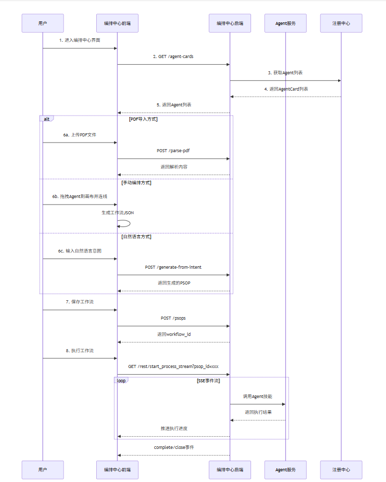
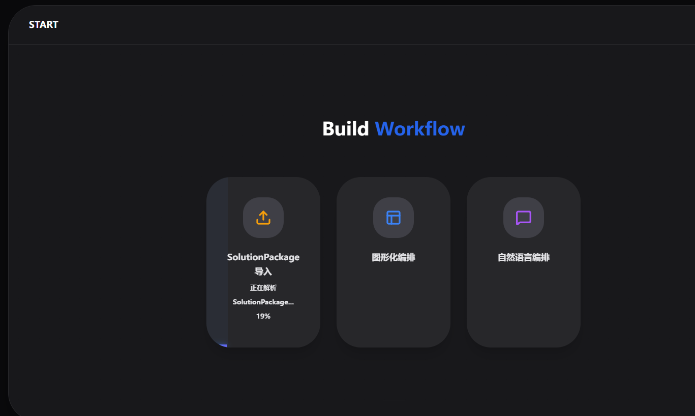
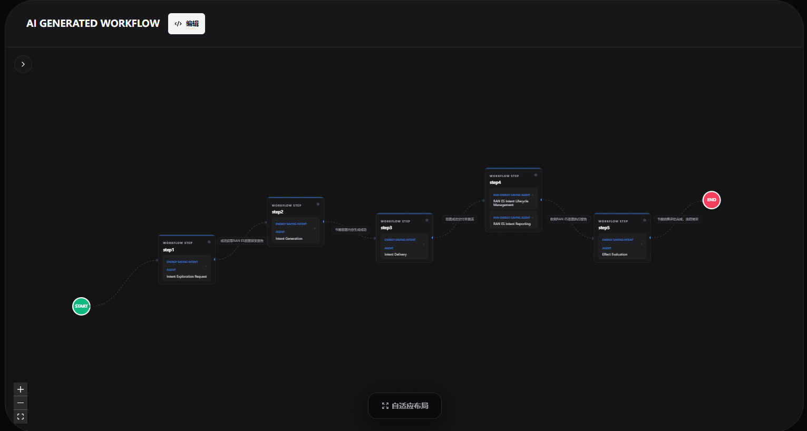
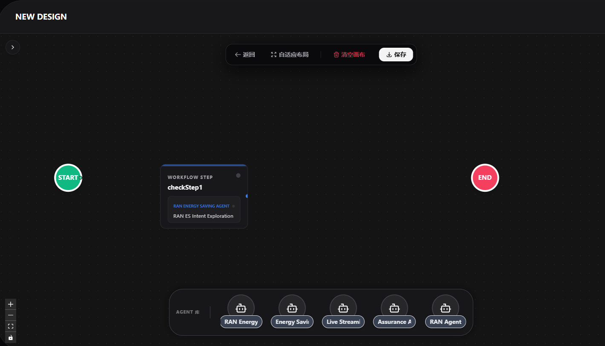
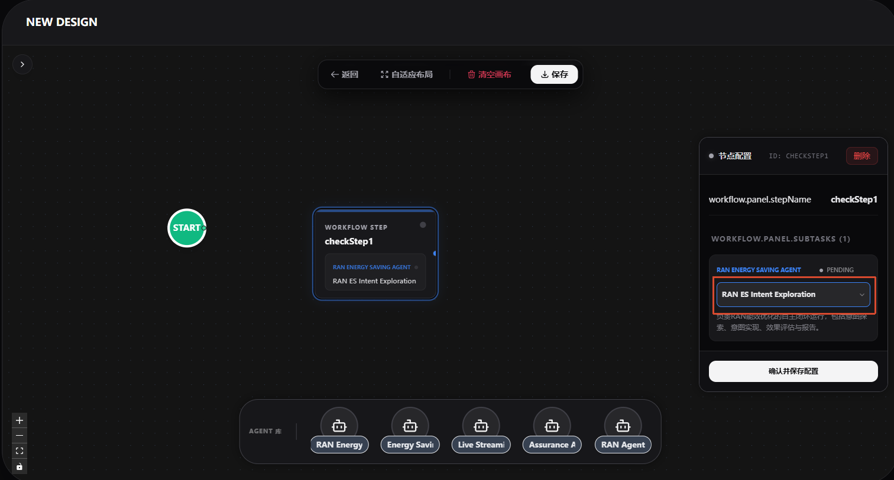
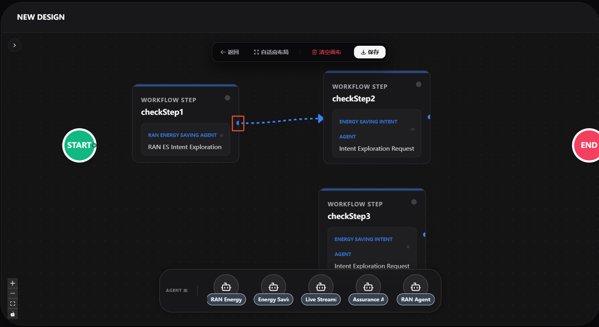
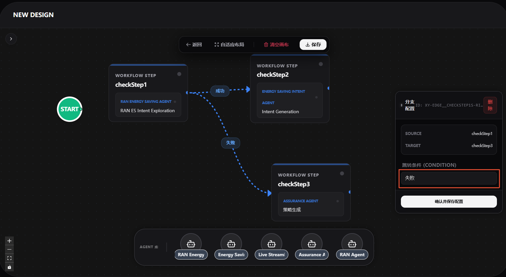
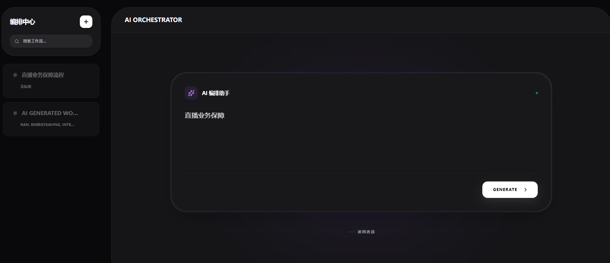
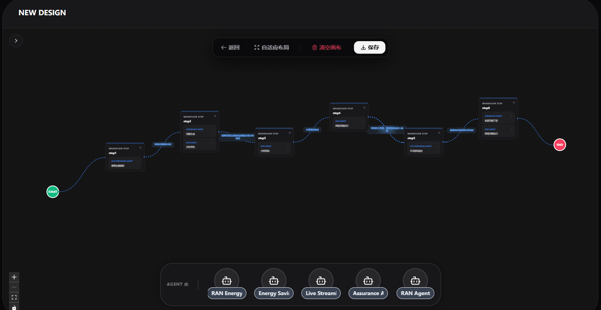

# 编排中心

## 特性介绍

编排中心是一个面向多智能体（Agent）协作的可视化编排平台，支持通过图形化工作流设计器定义 Agent 之间的调用关系与执行流程。后端基于 Python 框架解析流程并驱动 Agent 协同工作，帮助用户高效构建、管理和运行复杂的 Agent 协作流程。

### 应用场景

- **多 Agent 协作流程编排**：当业务需要多个智能体协同完成复杂任务时，可通过可视化方式定义调用关系与执行顺序。
- **工作流模板管理**：支持将常用的协作流程保存为模板，便于复用和分享。
- **智能工作流生成**：根据自然语言描述或 PDF 文档自动生成工作流规划，降低编排门槛。
- **实时流程监控**：支持流式执行工作流并实时推送运行进展，便于调试和监控。

### 能力范围

- **PSOP 管理**：支持工作流（PSOP）的列表查看、详情查询、保存与删除操作。
- **PDF 解析**：提供 PDF 文件内容解析能力，为后续流程设计提供数据支持。
- **智能规划**：根据用户需求自动生成工作流规划，降低编排门槛。
- **Agent 管理**：获取全量 AgentCard 列表，便于了解可用能力与调用方式。
- **自然语言生成 PSOP**：通过自然语言意图直接生成可执行的编排流程。
- **意图检索 PSOP**：根据自然语言描述，检索匹配的历史工作流。
- **实时流程执行**：支持以流式方式启动 PSOP 执行，并实时推送运行进展，便于监控与调试。

### 亮点特征

- **可视化编排**：提供图形化工作流设计器，通过拖拽和连线即可完成 Agent 协作流程设计，无需编写代码。
- **多模式生成**：支持 PDF 导入、手动编排、自然语言生成三种工作流创建方式，适配不同用户习惯。
- **智能检索**：基于自然语言意图检索历史工作流，快速复用已有流程。
- **实时流式执行**：通过 SSE 技术实时推送执行进度，便于前端展示和问题定位。

### 实现原理

编排中心的核心工作流程如下图所示：


### 与相关特性的关系

| 相关特性 | 关系说明 |
| --- | --- |
| 注册中心 | 编排中心从注册中心获取 AgentCard 列表，了解可用 Agent 及其能力 |

## 安装

### 前提条件

- **Node.js**：20.19 或更高版本
- **Python**：3.10 或更高版本（用于启动示例 Agent 服务）
- **网络**：确保编排中心前端、后端、注册中心之间的网络互通

### 开始安装

1. **启动注册中心服务**

   UI 界面展示的所有 Agent 信息均从注册中心获取。具体操作请参见注册中心的用户指南或快速入门文档。

2. **启动编排中心后端服务**

   具体操作请参见编排中心的快速入门文档。

3. **安装前端依赖并启动**
   
   进入安装目录下的 `workflow-designer` 目录：
   ```bash
   cd {安装目录}/workflow-designer
   npm install --force
   npm run dev
   ```
4. **（可选）启动示例 Agent 服务**

   如需查看完整 Demo，需要启动示例 Agent 服务（注册中心默认没有注册 Agent，该脚本会向注册中心注册多个 Agent 并启动对应服务）：

   ```bash
   cd {安装目录}
   python -m samples.start_agents_server
   ```
5. **（可选）使用一键启动脚本**

   进入项目目录下的 `bin` 文件夹，执行脚本文件（该脚本会自动启动前端服务和示例 Agent 服务）：

   ```bash
   cd {安装目录}/orchestration-center/bin
   ./start_samples.sh
   ```
## 使用

### 前提条件

- 注册中心服务已启动并正常运行
- 编排中心后端服务已启动并正常运行
- 编排中心前端服务已成功启动
- 浏览器可正常访问编排中心前端页面

### 背景信息

编排中心提供三种工作流创建方式：

- **PDF 导入**：解析 PDF 文档中的流程描述，自动生成工作流
- **手动编排**：通过拖拽 Agent 卡片到画布并连线，可视化定义流程
- **自然语言生成**：输入业务意图描述，后端自动生成对应的工作流

执行工作流时，系统通过 SSE（Server-Sent Events）技术实时推送执行进度，前端可实时展示每个 Agent 的请求和响应。

### 使用限制

- 当前版本仅支持解析 PDF 文档中标题为 "5. Interaction Flow" 的章节
- 工作流 ID 在保存时自动生成，不支持自定义
- 示例脚本启动的 Agent 仅供 Demo 演示使用，生产环境需对接真实 Agent 服务

### 操作步骤

1. **访问编排中心界面**

   打开浏览器访问 `http://localhost:3003`

2. **配置服务地址**

   点击界面右上角的齿轮状图标，将 IP 修改为编排中心实际的后端服务 IP，端口修改为编排中心实际监听的端口，点击保存。

   

3. **查看 Agent 库**

   左侧区域展示全部Agent列表，支持按Agent名称或功能关键词进行搜索筛选；点击任意Agent后，右侧区域将展示该Agent的详细信息。

   

4. **创建新工作流**

   - 点击左侧上方的 `+` 按钮
   - 选择创建方式：

     | 方式 | 操作说明 |
     | --- | --- |
     | PDF 导入 | 上传 PDF 文件，系统自动解析并生成 PSOP |
     | 手动编排 | 将下方 Agent 卡片拖拽到画布，通过连线定义执行顺序；点击连线可设置跳转条件 |
     | 自然语言生成 | 输入业务意图描述，后台自动编排生成 PSOP |

   **PDF导入：**

    点击“SolutionPackage 导入”选项，选择一份pdf的格式的文档上传，等待上传完成
    
    上传完成后，如下图所示，用户可以编辑后再进行保存：
    
    
   **手动编排：**
    - 步骤一 添加Agent卡片：
    从界面下方区域将所需的 Agent 卡片拖拽至画布空白区域。
    
    - 步骤二 配置Agent技能：
    点击画布上已添加的Agent卡片，在弹出的选项中选择需要使用的技能项。
    
    - 步骤三 添加更多Agent：
    重复步骤一和步骤二，根据业务需求将多个Agent拖拽至画布。
    - 步骤四 连接Agent卡片：
    将鼠标悬停在某个 Agent 卡片右侧的“小蓝点”上，此时鼠标指针会变为“十”字形状。按住鼠标左键不放，拖动至另一张 Agent 卡片上，松开鼠标即可完成连线。
    
    - 步骤五 配置分支条件：
    点击需要配置分支的连线，在弹出窗中的“分支配置”提示框内输入跳转条件并保存。这样，后续执行将根据不同的条件走不同的分支路径。
    
    - 步骤六 保存工作流：
    所有配置完成后，点击画布上方的“保存”按钮，即可完成工作流的创建或更新。
    
    
    **自然语言生成：**

    点击“自然语言编排”选项，在弹出的输入框中输入一段自然语言描述，点击“GENERATE”按钮
    
    生成后的PSOP工作流会展示在当前窗口，默认是“编辑”状态，可以直接保存，也可以修改后再进行保存。
    

5. **保存工作流**

   完成编排后，系统自动保存或手动触发保存操作，返回的 `workflow_id` 可用于后续检索和执行。

6. **查看已有工作流**

   在左侧面板展示所有的PSOP，并通过上方的搜索框按名称快速查找。点击任一PSOP后，右侧区域将自动显示其详细信息。

   

7. **执行工作流**
- 在上方输入框中输入用户意图；
- 点击右侧的“检索工作流”按钮；
- 系统检索到对应PSOP后，左侧区域将显示该PSOP；
- 中间区域自动展示该PSOP对应的工作流；
- 点击左侧PSOP右侧的“▶”按钮，页面右侧将实时显示工作流的执行过程。


## 附录

### 接口定义

#### 1. PDF 解析接口

##### `POST /parse-pdf`

上传 PDF 文件并解析指定章节。

**请求**:

- **方法**: POST
- **Content-Type**: multipart/form-data

| 参数名 | 类型 | 必填 | 描述 |
| --- | --- | --- | --- |
| file | file | 是 | PDF 文件 |

**成功响应**:
```json
{
  "status": "success",
  "message": "PDF文件解析成功",
  "content": "PreFlow JSON数据"
}
```
**错误响应**:

- 400: 未提供文件、文件名为空、非 PDF 文件，或未找到指定章节
- 500: 解析失败

---

#### 2. 工作流规划接口

##### `POST /plan`

提交任务和步骤，获取规划结果。

**请求体**:

```json
{
  "preflow": {
    "name": "工作流名称",
    "description": "工作流描述",
    "steps_md": "Markdown格式的步骤描述"
  },
  "agent_cards": [{
      "name": "RAN Energy Saving Agent",
      "description": "负责RAN能效优化的自主闭环运行，包括意图探索、意图实现、效果评估与报告。",
      "version": "1.0.0",
      "provider": {
        "organization": "Huawei",
        "url": "https://www.huawei.com"
      },
      "skills": [
        {
          "id": "ran-es-intent-exploration",
          "name": "RAN ES Intent Exploration",
          "description": "评估并确定指定RAN ES意图目标的最佳可能性，考虑当前资源状况和系统能力。",
          "tags": [
            "wireless",
            "energy-saving",
            "intent"
          ]
        },
        {
          "id": "ran-es-intent-lifecycle-management",
          "name": "RAN ES Intent Lifecycle Management",
          "description": "管理RAN节能意图的生命周期，包括创建、修改、删除、激活、去激活意图，并执行数据采集、分析、解决方案制定与配置。",
          "tags": [
            "wireless",
            "energy-saving",
            "intent"
          ]
        },
        {
          "id": "ran-es-intent-reporting",
          "name": "RAN ES Intent Reporting",
          "description": "提供意图报告查询、订阅、通知功能，报告意图实现状态、达成值、推荐值及配置修改信息。",
          "tags": [
            "wireless",
            "energy-saving",
            "reporting"
          ]
        }
      ],
      "capabilities": {
        "streaming": true,
        "pushNotifications": false,
        "extensions": []
      },
      "defaultInputModes": [
        "text",
        "json"
      ],
      "defaultOutputModes": [
        "text",
        "json"
      ],
      "supportedInterfaces": [
        {
          "protocolBinding": "GPRC",
          "protocolVersion": "1.0.0",
          "url": "http://127.0.0.1:5000/"
        },
        {
          "protocolBinding": "HTTP+JSON",
          "protocolVersion": "1.0.0",
          "url": "http://127.0.0.1:5000/"
        }
      ]
    }]
}
```
**成功响应:**
```json
{
  "status": "success",
  "data": "PSOP工作流JSON数据"
}
```
#### 3. PSOP 管理接口

##### `GET /psops`

获取 PSOP 列表。

| 查询参数 | 类型 | 必填 | 默认值 | 描述 |
| --- | --- | --- | --- | --- |
| limit | integer | 否 | 10 | 返回结果数量限制 |
| workflow_type | string | 否 | "psop" | 可选值: "all", "psop", "preflow" |

##### `GET /psops/{workflow_id}`

根据 ID 获取 PSOP 详情。

##### `POST /psops`

保存 PSOP。

**请求体**: PSOP 的 JSON 数据，必须符合 PSOP 模型定义。

**PSOP 模型字段**:

| 字段 | 类型 | 必填 | 描述 |
| --- | --- | --- | --- |
| id | string | 否 | 自动生成 |
| name | string | 是 | 工作流名称 |
| description | string | 否 | 工作流描述 |
| steps | List[Step] | 是 | 步骤列表 |
| tags | List[string] | 否 | 标签 |

##### `DELETE /psops/{workflow_id}`

删除指定 ID 的 PSOP。
#### 4. AgentCard 管理接口

##### `GET /agent-cards`

获取全量 AgentCard 列表。

---

#### 5. 意图生成接口

##### `POST /generate-from-intent`

根据自然语言意图生成 PSOP。

**请求体**:

```json
{
  "user_intent": "自然语言描述的业务意图",
  "workflow_name": "可选的工作流名称"
}
```
##### `POST /retrieve-by-intent`
根据自然语言意图检索 PSOP。

**请求体**:

```json
{
  "user_intent": "自然语言描述的业务意图"
}
```
#### 6. SSE 执行接口

##### `GET /rest/start_process_stream`

启动 PSOP 执行并通过 SSE 实时推送进度。

| 查询参数 | 类型 | 必填 | 描述 |
| --- | --- | --- | --- |
| psop_id | string | 是 | PSOP 工作流 ID |

**事件类型**: init, start, agent_request, agent_response, psop_update, complete, error, close
## FAQ

### 为什么启动后左侧 Agent 库为空？

**现象描述**：进入编排中心界面后，左侧 Agent 库没有显示任何 Agent。

**可能原因**：

- 注册中心服务未启动
- 编排中心后端服务未正确配置注册中心地址
- 示例 Agent 服务未启动（演示环境）

**解决办法**：

1. 确认注册中心服务已正常启动
2. 检查编排中心后端配置文件中的注册中心地址是否正确
3. 如需查看 Demo，执行 `python -m samples.start_agents_server` 启动示例 Agent

---

### PDF 解析失败，提示未找到指定章节

**现象描述**：上传 PDF 文件后，返回错误“PDF解析失败，未找到指定章节”。

**可能原因**：PDF 文档中不包含标题为 "5. Interaction Flow" 的章节。

**解决办法**：确保上传的 PDF 文档包含该章节，或联系管理员扩展支持的章节类型。

---

### 执行工作流时没有实时进度推送

**现象描述**：点击执行按钮后，右侧区域没有显示执行过程。

**可能原因**：

- 后端 SSE 连接异常
- 浏览器不支持 EventSource
- 工作流中的 Agent 服务未启动

**解决办法**：

1. 打开浏览器开发者工具，查看 Network 面板中 SSE 连接是否正常
2. 确认 Agent 服务已启动且网络可达
3. 尝试使用最新版 Chrome/Firefox 浏览器
